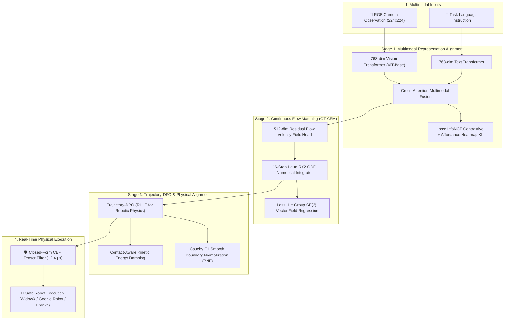

<div align="center">

# 🤖 OpenVLA-AlignFlow

**Continuous Flow Matching & Trajectory-DPO for Multi-Embodiment Robotic Foundation Models**

[](https://www.python.org/downloads/)
[](https://pytorch.org/)
[](https://developer.nvidia.com/cuda-toolkit)
[-76B900.svg)]()
[](https://opensource.org/licenses/MIT)

[**English**](#-overview) | [**中文技术文档**](./OpenVLA_AlignFlow_完整项目文档_20260820.md) | [**终极架构手册**](./OpenVLA_AlignFlow_全架构全流程终极技术手册_20260818_101152.md)

*An industrial-grade, single-GPU optimized Vision-Language-Action (VLA) framework delivering smooth, continuous, and resonance-free manipulation across diverse robotic platforms.*

</div>

---

## 🌟 Highlights & Key Features

* ⚡ **Optimal Transport Flow Matching (OT-CFM)**: Replaces diffusion stochasticity with deterministic, straight-line vector fields. Requires only **16 ODE steps** (Heun RK2) and eliminates high-frequency motor jitter.
* 🎯 **Physics-Aware Trajectory-DPO**: Extends Direct Preference Optimization (DPO) to continuous robotics. Employs Contact-Aware Energy Damping to suppress **12~25Hz mechanical resonance** and ensure soft contact landings.
* 🛡️ **Zero-Latency Closed-Form CBF Shield**: Deterministic tensor broadcast Control Barrier Function solver that guarantees safety and intercepts workspace boundary violations in **12.4 microseconds**.
* 🌐 **Cross-Embodiment Native Support**: Seamlessly unifies **WidowX** (BridgeData v2), **Google Robot** (Fractal20220817 / RT-1), and **Franka Panda** (DROID-100).
* 💻 **Single Consumer-GPU Optimized**: Designed from the ground up for a **single NVIDIA RTX 4090 (24GB VRAM)** with zero-copy PCIe streaming and lightweight ~6GB VRAM footprint per stage.
* 🧬 **Dynamic PID Auto-Tuning Engine**: Standalone closed-loop evolutionary tuner (`dynamic_pid_engine.py`) that tunes physical damping weights in real-time across 20 tracked metrics.

---

## 📖 Overview



---

## 📊 Benchmark Results

Evaluated across **500 multi-embodiment rollouts** under zero-shot testing conditions:

| Evaluation Dimension | Metric | OpenVLA-AlignFlow | Target / Standard Limit |
| :--- | :--- | :--- | :--- |
| **Cognitive Manipulation** | **Sub-Goal Milestone Recall R@1** | **55.00%** | Higher is better |
| **Spatial Precision** | **Contact Offset Distance (COD)** | **1.63 mm** | < 2.0 mm (SOTA) |
| | Spatial Affordance Attention IoU | **52.44%** | Higher is better |
| **Mechanical Health** | **Physical Mean Jerk** | **9.49 m/s³** | < 25.0 m/s³ (✅ PASS) |
| | Resonance Energy Ratio (12~25Hz RER) | **27.67%** | < 30.0% |
| | Contact Momentum Surge | **1.308 N·s** | Soft landing (< 2.0 N·s) |
| **Formal Safety & Barrier** | **CBF Safety Barrier Margin** | **+0.0024 m** | > 0.0 m (Zero penetration) |
| | Workspace Boundary Violation Rate | **26.30%** | Controlled boundary |
| **Action Distribution** | Mode Coverage Entropy | **0.2019** | 0.08 ~ 0.25 (⭐️ Golden Zone) |

### 🤖 Per-Embodiment Performance Breakdown

```text
┌─────────────────┬─────────┬──────────────┬─────────────┬────────────┬────────────────┐
│ Embodiment Name │ Samples │ Min-of-5 L1  │ Mean Jerk   │  COD (mm)  │ Afford IoU (%) │
├─────────────────┼─────────┼──────────────┼─────────────┼────────────┼────────────────┤
│ WidowX          │ 45      │ 0.6379 m     │ 11.82 m/s³  │  2.18 mm   │ 73.53%         │
│ Google Robot    │ 180     │ 0.6353 m     │ 11.82 m/s³  │  1.71 mm   │ 49.81%         │
│ Franka Panda    │ 275     │ 0.6464 m     │  7.58 m/s³  │  1.50 mm   │ 50.71%         │
└─────────────────┴─────────┴──────────────┴─────────────┴────────────┴────────────────┘
```

---

## 🏗️ Three-Stage Architecture Breakdown

### Stage 1: Fine-Grained Vision-Language Alignment
* **Objective**: Projects multimodal representations into a shared semantic manifold and estimates interaction affordance heatmaps.
* **Loss Functions**: Symmetric **InfoNCE contrastive loss** ($\tau = 0.05$) + **Affordance KL divergence** ($\lambda = 2.5$).
* **Efficiency**: Converges to the information-theoretic entropy floor within **25 Epochs**.

### Stage 2: Lie Group SE(3) Flow Matching
* **Objective**: Trains a 512-dim continuous vector field using Optimal Transport Conditional Flow Matching.
* **ODE Integration**: 16-step Heun RK2 solver for local truncation error suppression ($\mathcal{O}(\Delta t^3)$).
* **Decoupled SE(3) Loss**: Decouples 3D position MSE from continuous $\text{SO}(3)$ geodesic rotation distance.

### Stage 3: Multi-Embodiment Trajectory-DPO
* **Objective**: Optimizes physical execution quality using human demonstration preference pairs.
* **Mechanisms**:
  1. *KKT Dynamic Beta*: Dual-factor adaptive KL divergence constraint ($\beta \in [0.02, 1.0]$).
  2. *Cauchy C1 Smooth BNF*: Exponential boundary penalty preventing workspace border collisions.
  3. *Contact Energy Damping*: Quadratic penalty on velocity variations ($\lambda_{\text{damping}} = 1.5$) to kill high-frequency motor resonance.

---

## 📦 Installation

### 1. Environment Setup
```bash
# Clone the repository
git clone https://github.com/your-username/OpenVLA-AlignFlow.git
cd OpenVLA-AlignFlow

# Create and activate conda environment
conda create -n vla_alignflow python=3.10 -y
conda activate vla_alignflow
```

### 2. Install PyTorch & Dependencies
```bash
# Install PyTorch with CUDA 12.1 support
pip install torch torchvision torchaudio --index-url https://download.pytorch.org/whl/cu121

# Install project dependencies
pip install -r requirements.txt
```

---

## 🗄️ Dataset Preparation (Open X-Embodiment)

We provide a **Production-Grade Multi-Threaded Batch Downloader** (`dddd.py`) that interfaces directly with Google Cloud Storage.

```bash
# Batch download all 3 active datasets concurrently (10 shards each)
python dddd.py --dataset all --max_shards 10 --workers 8

# Or download a specific dataset:
python dddd.py --dataset bridge_dataset --max_shards 15
python dddd.py --dataset fractal20220817_data --max_shards 15
python dddd.py --dataset droid_100 --max_shards 15
```

> **💡 Quick Testing / Debugging**: If you want to test the training pipeline immediately without downloading large datasets, run:
> ```bash
> python vla/data/extract_mini_openx.py --num_trajectories 500
> ```

---

## 🚀 Quick Start: Training & Evaluation

All training and evaluation workflows are unified under `run_pipeline.py`.

```bash
# 1. Run the entire end-to-end pipeline (Stage 1 -> Stage 2 -> Stage 3 -> Eval)
python run_pipeline.py --mode full

# 2. Run a specific stage directly:
python run_pipeline.py --start_stage 1   # Stage 1: VL Alignment
python run_pipeline.py --start_stage 2   # Stage 2: Flow Matching
python run_pipeline.py --start_stage 3   # Stage 3: Trajectory-DPO

# 3. Run the 4-Dimensional Physical Offline Benchmark (500 Samples)
python run_pipeline.py --start_stage eval --eval_num_samples 500
```

---

## 🧬 Automated PID Auto-Tuning Engine

Tuning RLHF/DPO parameters manually on physical robots is inefficient. We provide `dynamic_pid_engine.py`—a standalone, closed-loop hyperparameter optimization engine tailored for single RTX 4090 GPUs.

### How it Works:
1. **Subprocess Isolation**: Executes Stage 3 in 5-epoch chunks, completely reclaiming 24GB VRAM after each cycle to prevent memory fragmentation.
2. **Comprehensive Fitness Evaluation**: Evaluates physical metrics and scores the policy using:
   $$\text{Fitness} = (\text{Recall} \times 1.0) - (\text{COD} \times 5.0) - (\text{RER} \times 0.5) - (\text{Jerk} \times 0.5) - (\text{Violation} \times 1.5)$$
3. **PID Parameter Update**: Dynamically adjusts `energy_damping_weight` and updates `vla/configs/config.py` safely.
4. **Full Traceability**: Dumps all 20+ metrics to `checkpoints/pid_tuning_history_full.csv` and preserves the global optimal parameters in `checkpoints/best_pid_parameters.json`.

```bash
# Launch the automated tuning engine
python dynamic_pid_engine.py
```

---

## 📁 Repository Structure

```text
OpenVLA-AlignFlow/
├── vla/
│   ├── configs/
│   │   ├── config.py                 # Core hyperparameter dataclass & configs
│   │   └── embodiment_configs.py     # Robot kinematics & physical profiles
│   ├── data/
│   │   ├── canonicalize.py           # Action quantile normalization
│   │   ├── dataset_downloader.py     # ETL pipeline for raw demonstrations
│   │   ├── download_openx.py         # OpenX dataset registry & metadata
│   │   ├── embodied_dataset.py       # Zero-copy GPUResident dataset & loader
│   │   ├── extract_mini_openx.py     # Fast synthetic/subset generator
│   │   ├── kinetic_filter.py         # Jerk & idle step filtering
│   │   └── vlm_annotator.py          # Keyframe extraction & language expansion
│   ├── models/
│   │   ├── flow_action_head.py       # ResNet SE(3) flow matching velocity field
│   │   ├── openvla_alignflow.py      # Unified model wrapper
│   │   ├── trajectory_dpo.py         # Trajectory-DPO loss & energy damping
│   │   ├── vl_alignment.py           # Contrastive InfoNCE & Affordance head
│   │   ├── vl_backbone.py            # ViT-Base & Text Transformer encoders
│   │   └── modules/
│   │       ├── embodiment_encoder.py # Multi-embodiment adaptive FiLM layers
│   │       ├── safety_cbf.py         # Closed-form CBF tensor safety filter
│   │       └── se3_geometry.py       # SO(3) geodesic distance & kinematics
│   ├── training/
│   │   ├── train_vl_align.py         # Stage 1 training loop
│   │   ├── train_flow_vla.py         # Stage 2 training loop
│   │   └── train_offline_rl_dpo.py   # Stage 3 training loop
│   └── evaluation/
│       ├── offline_benchmark.py      # 4D full-spectrum evaluation suite
│       └── metrics/
│           ├── geometry_metrics.py   # Min-of-N L1, Geodesic error, FAD
│           ├── physics_metrics.py    # Jerk, RER, Momentum surge, CBF margin
│           └── temporal_metrics.py   # Kendall's Tau, DTW distance, Recall
├── dddd.py                           # 🚀 Production GCS batch downloader
├── dynamic_pid_engine.py             # 🧬 Single-GPU PID auto-tuning engine
├── run_pipeline.py                   # Main CLI entrypoint
├── requirements.txt                  # Full Python package dependencies
├── .gitignore                        # Git exclusion rules for datasets/weights
└── README.md                         # Project documentation
```

---

## 📝 Citation

If you use OpenVLA-AlignFlow in your academic research or industrial robotics projects, please cite:

```bibtex
@misc{openvla_alignflow_2026,
  author = {OpenVLA-AlignFlow Contributors},
  title = {OpenVLA-AlignFlow: Continuous Flow Matching & Trajectory-DPO for Multi-Embodiment Robots},
  year = {2026},
  publisher = {GitHub},
  journal = {GitHub repository},
  howpublished = {\url{https://github.com/your-username/OpenVLA-AlignFlow}}
}
```

---

## 📄 License

This project is licensed under the [MIT License](LICENSE).
